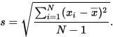
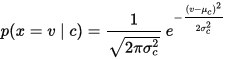

# Implement Naive Bayes From Scratch in C++ (Udacity Self Driving Car Term 3 Prediction quiz)
Implement a Gaussian Naive Bayes classifier to predict the behavior (keep, left, right) of vehicles.

1. calculate mean and standard deviation for each class (Training)



2. Substitute mean, standard deviation, and state to Gaussian Naive Bayes Equation  
per state and choose class that has max probability (Prediction)



# Build

```bash
g++ -o gNB.exe classifier.cpp classifier.h main.cpp -std=c++11
```

# Reference

[How To Implement Naive Bayes From Scratch in Python](http://machinelearningmastery.com/naive-bayes-classifier-scratch-python/)

